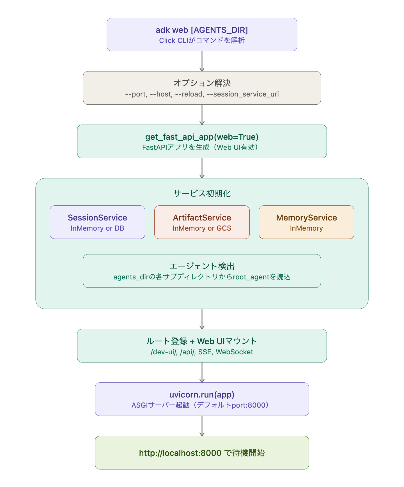

Google ADK（Agent Development Kit）で `adk web` コマンドを実行してからlocalhostが起動するまでのフローを解説します。GitHubのページ自体のコード取得ができなかったので、rawファイルを取得してみます。十分な情報が揃いました。ソースコードレベルの内部フローまで含めて解説します。`adk web` コマンドの内部フローを図を交えて解説します。以下、各ステップを順に解説します。

**1. CLIコマンドの解析**

`adk web` コマンドは `cli_tools_click.py` 内で Click フレームワークの `@main.command("web")` として定義されています。引数として `AGENTS_DIR`（エージェントが置かれたディレクトリ）を受け取り、デフォルトはカレントディレクトリです。`adk web --help` で確認できるように、各サブディレクトリが1つのエージェントに対応し、少なくとも `__init__.py` と `agent.py` を含む必要があります。

**2. オプションの解決**

`--port`（デフォルト8000）、`--host`（デフォルト127.0.0.1）、`--reload`（ホットリロード有無）、`--session_service_uri`、`--artifact_service_uri`、`--memory_service_uri` など複数のオプションが `fast_api_common_options()` と `adk_services_options()` というデコレータ群で共通定義されています。これらのオプションは `adk web` と `adk api_server` で共有されており、デコレータパターンで統一的に管理されています。

**3. `get_fast_api_app(web=True)` の呼び出し**

CLIの `web` コマンドと `api_server` コマンドは、内部的に同じ `get_fast_api_app()` 関数を呼び出しており、`web` パラメータの値でUIの有無が切り替わります。この関数は `google.adk.cli.fast_api` モジュールに定義されています。`adk web` の場合は `web=True` が渡され、Angular製のDev UIも配信されるようになります。

**4. サービスの初期化**

`get_fast_api_app()` の内部では、3つの主要サービスが初期化されます。

`session_service_uri` が指定されていなければ InMemory のセッションサービスが使われ、`artifact_service_uri` が `gs://` で始まる場合は GCS ベースのアーティファクトサービスが、それ以外は InMemory が使われます。MemoryService も同様にデフォルトは InMemory です。

**5. エージェント検出とルート登録**

`agents_dir` で指定されたディレクトリの各サブディレクトリからエージェントが動的に読み込まれます。各サブディレクトリの `agent.py` 内に定義された `root_agent` が検出対象です。FastAPIアプリには REST API のエンドポイント群（セッション作成、メッセージ送信、SSE ストリーミングなど）が登録され、`web=True` の場合はさらに `/dev-ui/` パスに Angular の Web UI 静的ファイルがマウントされます。

**6. Uvicorn の起動**

最終的に Uvicorn（ASGI サーバー）が起動し、ターミナルに「Started server process」「Waiting for application startup」「Application startup complete」というログが順に出力されます。デフォルトでは `--reload` が有効なため、ファイル変更を監視して自動再起動するモードで立ち上がります。

**7. localhost で待機開始**

起動が完了すると、`http://localhost:8000` でサーバーがリクエストを受け付ける状態になります。ブラウザでこのURLにアクセスすると、左上のドロップダウンからエージェントを選択し、チャット形式でエージェントとやりとりできるDev UIが表示されます。

まとめると、`adk web` は Click CLI → オプション解析 → `get_fast_api_app(web=True)` → サービス群初期化＋エージェント動的読込 → FastAPI ルート＋Web UI マウント → Uvicorn 起動、という一連のフローで localhost のサーバーを立ち上げています。